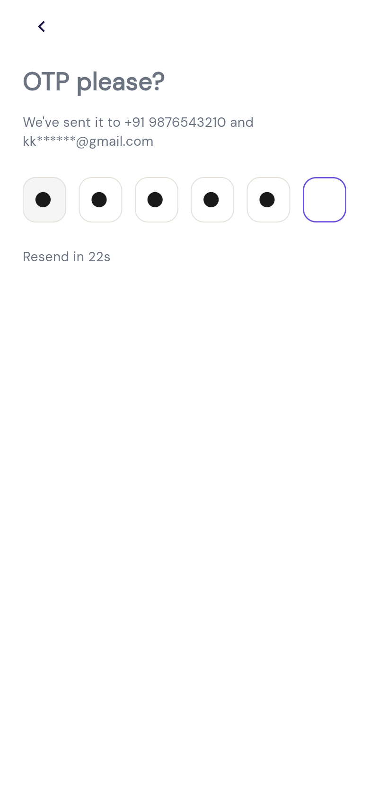
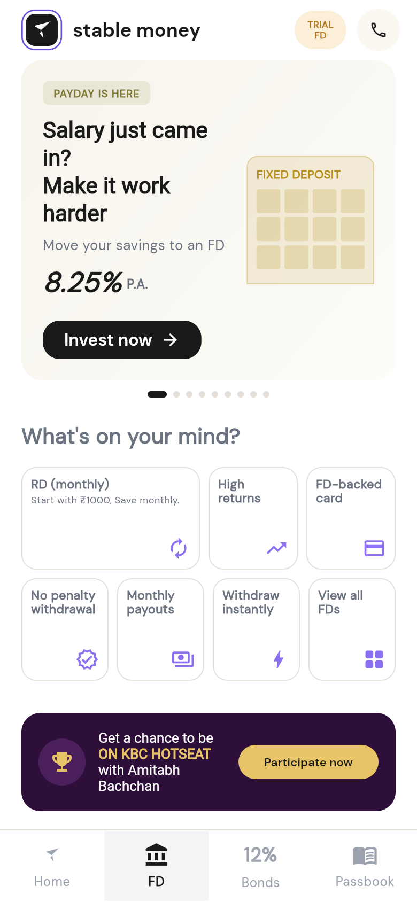
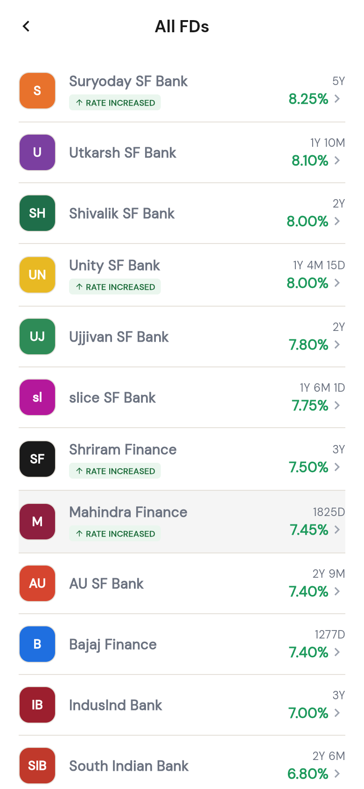
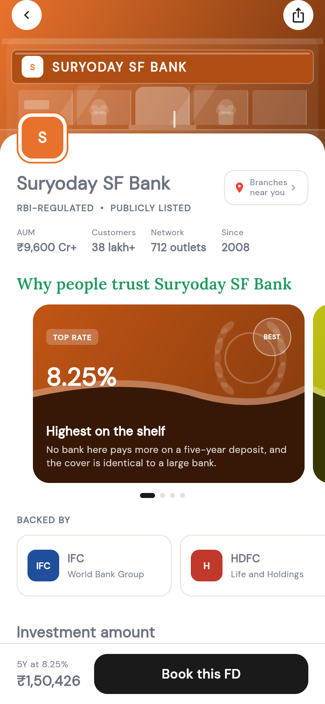
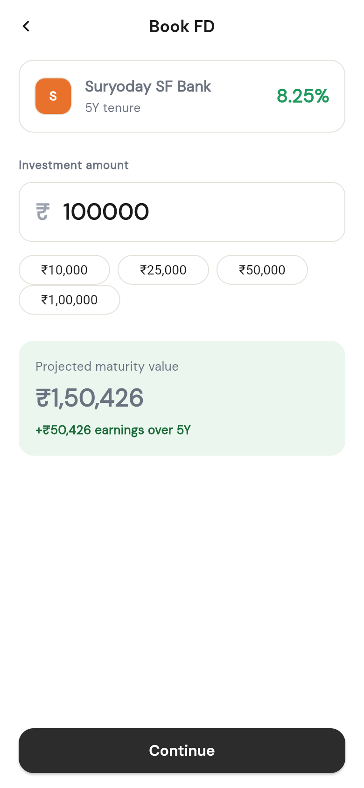

<div align="center">

# Stable Money: Retention Prototype

**A product management capstone. Three small features that give first-time FD investors a reason to come back.**

[**Live prototype**](https://stable-money-prototype.himanshu-etc1.workers.dev/) · [**Case study (PDF)**](docs/Stable-Money-Capstone-Case-Study.pdf) · [The three features](#the-three-features) · [Run it locally](#run-it-locally)


</div>

<p align="center">
  
  
  
  
  
</p>

> **Note:** This is a prototype, not the real Stable Money app, and it is not affiliated with or endorsed by Stable Money. It uses sample data only, and no real investments can be made through it.

## The problem

Stable Money is a digital fixed-deposit marketplace. Its problem is **retention, not acquisition**: users trust it enough to book one FD, but most never come back.

| | |
|---|---|
| **Problem** | 4 out of 5 first-time FD investors do not invest again within 90 days |
| **North Star** | 90-day repeat transaction rate |
| **Baseline → Target** | 20% → 35% within 6 months |

These figures come from the case brief. The targets are goals the plan is designed to hit, not results I measured.

## What the research found

From app reviews, forums and review sites, I grouped the pain points into four personas and four barriers:

- **Exit is harder than entry.** Booking is smooth. Withdrawing or tracking a redemption is slow and unclear.
- **Trust doubts show up before any bad experience.** People question why they should park money with smaller finance banks.
- **Support drops once the first product is active.**
- **Bonds and the FD card underperform** the core FD flow, so the "second investment" feels risky.

An FD is also a "set and forget" product. Once the money is in, nothing pulls the user back into the app.

## The three features

Seven ideas were scored with RICE, and three were carried into the prototype.

1. **Per-bank trust banner.** Before booking, each bank page shows why it can be trusted: regulator, backers, size, years in business. This answers the doubt that comes before any bad experience.
2. **Redemption terms upfront.** The exit rules that matter most (how fast, any conditions) move out of the fine print into a short, highlighted summary before the user commits.
3. **Plan your next investment.** Right after a successful payment, a short page suggests a small monthly recurring deposit timed to salary credit. It is small enough to say yes to, and it gives the user a reason to return.

The other four ideas (a trackable withdrawal with proactive delay handling, a Home-screen support bot that grows with the relationship, a lite mode for weak networks, and resume-where-you-left-off for interrupted payments) are in the case study but were not prototyped.

## How success is measured

Level 1 metrics, with the baselines and targets set in the case study:

| Metric | Baseline | Target |
|---|---|---|
| Activation rate (KYC started → first booking) | 62% | 68% |
| Week 4 retention | 35% | 48% |
| Feature adoption (next-step recommendation) | new feature | 60%+ |
| DAU/MAU among first-time investors | 8% | 12% |

The case study also covers guardrail metrics, risks and trade-offs, and a phased rollout (10% → 50% → 100%).

## Try the prototype

Open the [live link](https://stable-money-prototype.himanshu-etc1.workers.dev/) on your phone or laptop.

- Enter **any 10-digit number** to sign in, and **any 6 digits** as the OTP.
- Open **FD → View all FDs → any bank** to see the trust banner, then **Book this FD** to follow the booking flow through to the payment success screen.
- Profile → **Appearance** switches between Light, Dark and Gradient.
- Everything lives in memory. A refresh resets the app to logged out.

## Run it locally

```bash
flutter pub get
flutter run -d chrome
```

Build and deploy (Cloudflare Workers, static files only):

```bash
flutter build web --release
npx wrangler deploy
```

More detail is in [DEPLOY.md](DEPLOY.md).

## Project layout

```
lib/
  screens/     onboarding, home, fd, bonds, booking flow, passbook, profile
  widgets/     trust banner, next-step card, hero carousel, growth chart
  logic/       next-step recommendation logic
  data/        mock banks, bonds and rates
  state/       in-memory app state
  theme/       Light / Dark / Gradient design tokens
docs/          case study PDF and screenshots
```

## Author

Built by **Himanshu** as part of the Airtribe product management program.
